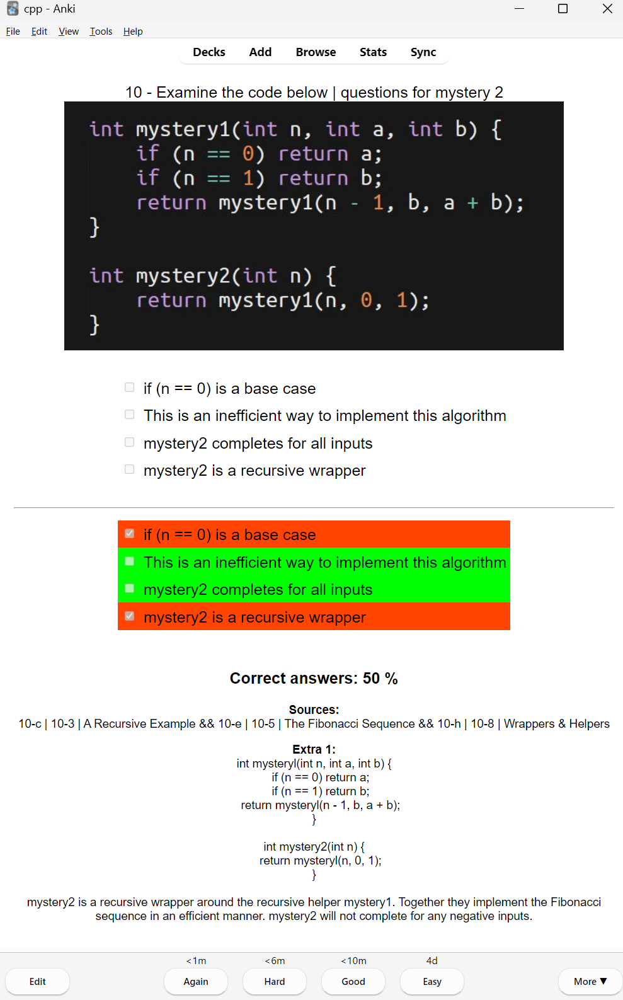

# cs150-midterm3
Midterm 3 -  See .akpg for Anki flashcards. Quizlet folder for quizlet sources. Number folders for relevant chapters.

## Download
<!-- WIP -->
<!-- * Using git: `git clone https://github.com/gogocplusplus/cs150-midterm2.git`
* Using google drive: https://drive.google.com/drive/folders/1HR7O-9s13dyQ0NqVU3SldeKe4lMUQdVB?usp=drive_link -->
* Releases: https://github.com/gogocplusplus/cs150--midterm3/releases
* Disregard the Source code .zip and tar.gz

--

## PDFs - Coursereader in .pdf format
* Below is a github link with all the PDFs, it is more efficent than using the online coursereader because you can search for specific topics using the search tool
* https://github.com/gogocplusplus/cs150-pdf

---

## Optional search tool - free (for Windows)
### Agent Ransack / Filelocator Lite
https://www.mythicsoft.com/
or
https://www.mythicsoft.com/agentransack/

### Example of using free optional search tool


--

## Anki
* Anki is a flashcard app. The advantage over quizlet is that it is local and can keep track of the questions you missed and lets you hide the questions you got right for either (for 1 min, 6 min, 10 min, 1 day, can be customized).
* Also it is free, more customizable and easier to create flashcards
* For this we will need to install Anki: https://apps.ankiweb.net/
* Download the `Anki for Windows 10/11 (2.1.65 QT6)` or whatever version, Mac, or Linux Distro you are using
* After you install Anki, run it and import the `cs150-midterm2.apkg` but either double clicking on it or importing it from within the Anki app


### Instructions after import
* Your Anki should like like the image below, but before you use the flashcards, you have to use Anki addons since the multiple-choice questions do not come with Anki by default


### Enable multiple-choice questions
* In Anki `Ctrl + Shift + A` or Tools => Add-ons
* Click `Get Add-ons...` on the top right navbar


* In the `Code:  ` field paste `1566095810` and click OK
* Restart Anki to apply changes
* Multiple Choice for Anki addon information:
* Anki Page: https://ankiweb.net/shared/info/1566095810
* Github: https://github.com/zjosua/anki-mc/
* Note: You only need to install the `Multiple Choice for Anki` addon, `AnkiConnect` and `Fill the blanks -Multiple typecloze support` (not necessary because `.apkg` files come with the flashcard templates) are not necessary

* Your Add-ons should look like the below:


---

### Enable fill-in-the-blank with answer-choices questions - incase fill in blank does not work
(might already be enabled when opening up `cs150-midterm2.apkg`)
* In Anki `Ctrl + Shift + I` or File => Import => `interactive.akpg`
* Restart Anki to apply changes
* You can delete the Default deck that it creates - but it provides reference templates for fill in the blank card creation
* Fill-in-the-blank with answer-choices information:
* Github: https://github.com/qwiglydee/anki-interactive/

* Your Note Types should look like the below image:


---

### Launching Flashcards
* After you click on a deck like `cs150-midterm2` it'll take you to the screen below, click `Study Now`:


* There are no hotkeys to select the multiple choice answer that I know of
* The hotkeys are `space` to Show the Answer and to `1` for `Again or to test <1m`, `2` for `Hard or to test <6m`, `3` or `Good or to test <10m`, `4` or `Easy or to test in 4 days or 4d`

* For the below sections it might be best to ignore the colors and at the bottom, look at the filled checkbox which was actually the correct answer

* To focus on learning specific section or set of questions, you want to click `Again` next the the `<1m` to avoid adding additional flashcards, you can reset the progress by Deleting the deck and reimporting 

*If you get a `single-choice` question answer correct it tells you: `Correct.`. At the bottom, the checkbox of what you selected at the top should match the filled checkbox.


*If you get a `single choice` question answer wrong it tells you: `Nope.`, For some reason, the sections with `red` will be highlighted. It'll show two red sections. At the bottom it'll show the one you selected without the checkbox and the correct answer will be the other red section with the checkbox filled.


* If you get a `multi-selection` answer correct it tells you: `Correct answers: 100%.`. Everything will be highlighted `green`.


* If you get a `multi-selection` answer partially correct it tells you: `Correct answers: __%.`. The incorrect answer that was selected will be highlighted in `red`. Note that only the checkboxed answers are correct, the non-checkboxed answer highlighted in green is the one which was not selected but is incorrect.


* If you get a `multi-selection` answer all incorrect it tells you: `Correct answers: 50%(nothing was selected) or 0%`. The incorrect answer that was selected will be highlighted in `red`. Note that only the checkboxed answers are correct, the non-checkboxed answer highlighted in `green` is the one which was not selected but is incorrect. General rule just look at the checkboxes above and checkboxes below for answers.
* Nothing selected:

* All incorrect selected:


* `Fill in the blank` should look like this, if not then go the the Misc section below:


* If you get a `fill-in-the-blank` (cloze) answers all correct, all sections will be highlighted `green`:


* If you get a `fill-in-the-blank` (cloze) some answers incorrect, the incorrect answer sections will be highlighted in `yellow`:


---

### Set Daily Card Limits to max
* Increase new cards/day to max - no limit
1. Click on the gearbox icon in the image below:

2. Scroll through settings and under `Daily Limits`, change `New cards/day` and `Maximum review/day` to more than the total number of cards. For example `250` and `2500`.


---

### Editor
* You can edit cards by clicking the `Browse` tab:


---

### Misc
* In the case that `fill-in-the-blank` colors are too light, but replace the `:root` section of the 


```css
  :root {
    --theme-primary: hsl(199, 100%, 50%);
    --theme-primary-dark: hsl(199, 100%, 20%);
    --theme-secondary: hsl(36, 100%, 50%);

    --theme-correct: hsl(120, 60%, 40%);
    --theme-correct-dark: hsl(120, 50%, 50%);
    --theme-missed: hsl(50, 80%, 60%);
    --theme-missed-dark: hsl(50, 50%, 50%);

    --theme-background0: hsl(199, 100%, 20%);
    --theme-background1: hsl(0, 0%, 15%);
    --theme-foreground1: rgba(255, 255, 255, .87);
    --theme-foreground2: rgba(255, 255, 255, .54);
    --theme-divider: hsla(199, 100%, 80%, .12);
    --theme-disabled: hsla(199, 100%, 80%, .26);
    --theme-placeholder: hsla(199, 100%, 80%, .38);

    --state-hover: .04;
    --state-selected: .08;
    --state-focus: .12;
    --state-activated: .12;

    --theme-fieldbox: rgba(255, 255, 255, .05);
    --theme-fieldbox-hover: rgba(255, 255, 255, .09);
    --theme-hover: rgba(255, 255, 255, var(--state-hover));
    --theme-selected: rgba(255, 255, 255, var(--state-selected));
    --theme-focus: rgba(255, 255, 255, var(--state-focus));
    --theme-active: rgba(255,255,255, var(--state-activated));

    --md-shadow-z1: 0 2px 1px -1px rgba(0,0,0,.2), 0 1px 1px 0 rgba(0,0,0,.14), 0 1px 3px 0 rgba(0,0,0,.12);
    --md-shadow-z2: 0 3px 1px -2px rgba(0,0,0,.2), 0 2px 2px 0 rgba(0,0,0,.14), 0 1px 5px 0 rgba(0,0,0,.12);
    --md-shadow-z8: 0 5px 5px -3px rgba(0,0,0,.2), 0 8px 10px 1px rgba(0,0,0,.14), 0 3px 14px 2px rgba(0,0,0,.12);
}
```